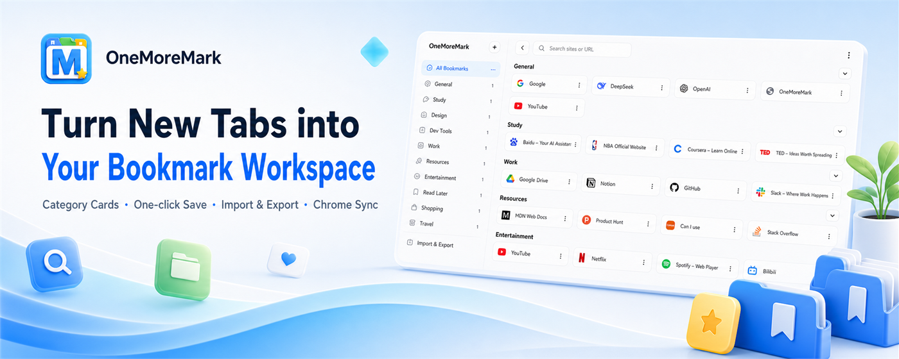
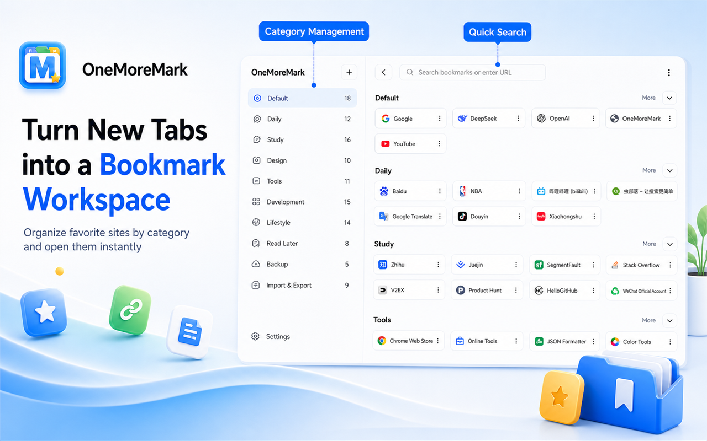
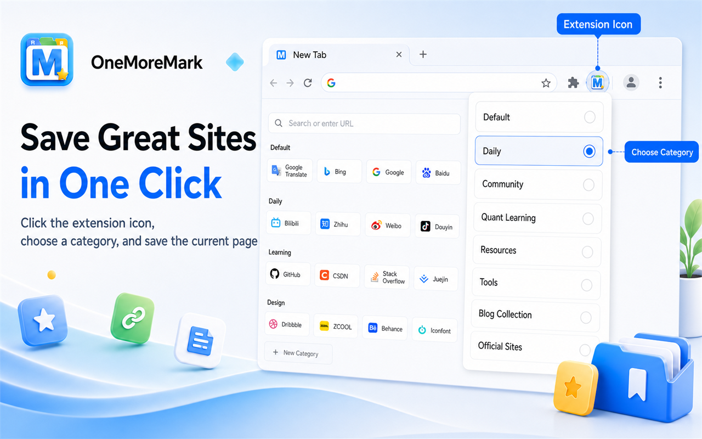
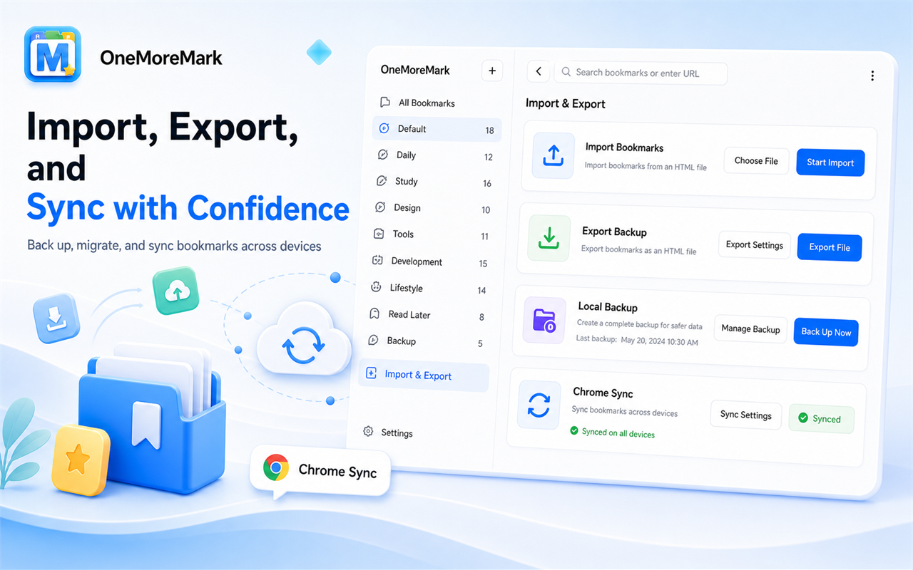
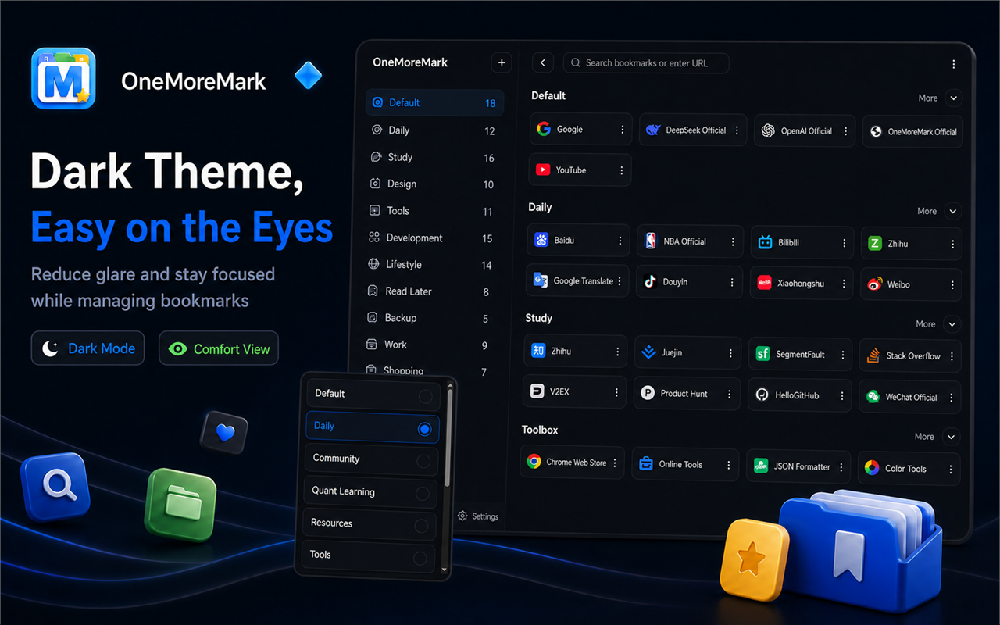

# OneMoreMark

[简体中文](./README.md)

If your browser bookmark bar is already too crowded, your bookmark folders keep getting deeper, and your temporary research tabs are always too useful to close, OneMoreMark is built for that everyday situation.

It is not here to make you “save more links.” It helps you put the websites you have saved, want to save, or have not had time to organize yet into a clearer new tab workspace. Every time you open a new tab, you can return to your own resource map instead of digging through the bookmark bar, browser history, and a long row of open tabs.

## What OneMoreMark Solves

Many websites are not opened every day, but they are still worth keeping. AI tools, developer documentation, design inspiration, product references, learning materials, research links, and articles to read later all fall into this category.

Traditional bookmarks can save them, but organizing and revisiting them is not always easy:

- The bookmark bar has limited space, so frequently used sites and low-frequency resources get mixed together.
- Folder levels become too deep, and saved links are rarely opened again.
- Temporary research can leave you with a full row of tabs: closing them feels risky, but keeping them open gets in the way.
- As your collection grows, it becomes harder to remember why a link was saved in the first place.

OneMoreMark takes a direct approach: move these websites out of the crowded bookmark bar, reorganize them with categories and cards, and make bookmarks easier to see, search, move, and back up.

## Turn New Tab Into A Bookmark Workspace

After installing OneMoreMark, your Chrome new tab page becomes a visual bookmark panel. Categories stay on the left, website cards stay on the right, and you can organize resources around the way you actually work.

It is useful for managing:

- Tool entrances you use every day.
- Resource collections for a specific project.
- Design, development, product, learning, and other topic-based resources.
- Temporary research pages you want to process later.

In the new tab page, you can create categories, rename categories, drag to reorder them, and move cards between categories. Compared with bookmarks hidden inside browser menus, the card view is easier to scan and revisit.

## Save The Current Website In One Click

When you find a page worth keeping, click the OneMoreMark icon in the browser toolbar, choose a category in the popup, and save the current page.

This is useful for pages that you may need later, but do not want to interrupt your current work to organize immediately. Save them to a suitable category first, then refine the structure from the new tab page later.

If the current URL has already been saved, OneMoreMark avoids creating a duplicate. If you want to move it to another category, you can do that too.

## Put Away A Whole Set Of Temporary Tabs

During research, comparison, documentation lookup, or inspiration hunting, it is common to open a full row of temporary tabs. They may not all deserve a permanent place on the bookmark bar, but closing them directly can lose useful context.

OneMoreMark can save the bookmarkable tabs in the current window in one action and archive them into a temporary category. You can put the work session away first, bring the browser back to a cleaner state, and review those pages later.

## Import, Export, And Sync

If you already have a collection of Chrome bookmarks, you can import them into OneMoreMark through a bookmark HTML file. If you want to back up or migrate your data, you can export your OneMoreMark collection as a Chrome-compatible bookmark file.

OneMoreMark currently supports:

- Importing Chrome bookmark HTML files.
- Exporting current bookmarks as an HTML file.
- Preserving the category structure.
- Syncing bookmark data when Chrome sync is available.
- Viewing local and cloud sync status.

Your bookmark data is stored in browser storage. OneMoreMark does not add a separate account system, and it does not force your collection into a specific cloud service. You can use Chrome sync, or manually back up your data through exported files.

## Details For Daily Use

OneMoreMark does not try to be complicated. It tries to make bookmark management feel smooth in daily use. Categories stay fixed on the left, content stays focused on the right, search remains visible, and import/export, sync status, and theme switching live in the tool area until you need them.

The plugin currently supports:

- A new tab bookmark panel.
- Quick saving from the extension popup.
- Category management and drag sorting.
- Bookmark card sorting and moving across categories.
- Search by title and URL.
- Chrome bookmark HTML import and export.
- Chrome sync status viewing and manual sync.
- Light, dark, and browser-matched themes.
- Simplified Chinese and English interfaces.

## Installation

If you just want to use it normally, installing from the Chrome Web Store is recommended. It is the simplest option and makes future updates easier.

**Click to install: Chrome Web Store - OneMoreMark**

[https://chromewebstore.google.com/detail/tabcard/mimfanignegkbnkcenlnkpigpnpkmbgk](https://chromewebstore.google.com/detail/tabcard/mimfanignegkbnkcenlnkpigpnpkmbgk)

If the Chrome Web Store is temporarily unavailable, or if you prefer manual installation, you can download the extension package from GitHub Releases. If GitHub is difficult to access, you can also use the Gitee repository and Gitee Releases.

**Click to view: OneMoreMark GitHub repository**

[https://github.com/seven-share/OneMoreMark](https://github.com/seven-share/OneMoreMark)

**Click to download: GitHub Releases package**

[https://github.com/seven-share/OneMoreMark/releases](https://github.com/seven-share/OneMoreMark/releases)

**Click to view: OneMoreMark Gitee repository**

[https://gitee.com/helloxiaotong/OneMoreMark](https://gitee.com/helloxiaotong/OneMoreMark)

**Click to download: Gitee Releases package**

[https://gitee.com/helloxiaotong/OneMoreMark/releases](https://gitee.com/helloxiaotong/OneMoreMark/releases)

### **Manual Installation Steps**

1. Open the GitHub Releases or Gitee Releases page, then download the latest ZIP package.
2. Extract the ZIP package to a local folder.
3. Open `chrome://extensions/` in the Chrome address bar.
4. Turn on “Developer mode” in the top-right corner.
5. Click “Load unpacked.”
6. Select the extracted extension folder.
7. After installation, open a new tab to enter OneMoreMark.

If there are multiple folders after extraction, choose the level that contains `manifest.json`. Chrome extensions must be loaded from that directory.
