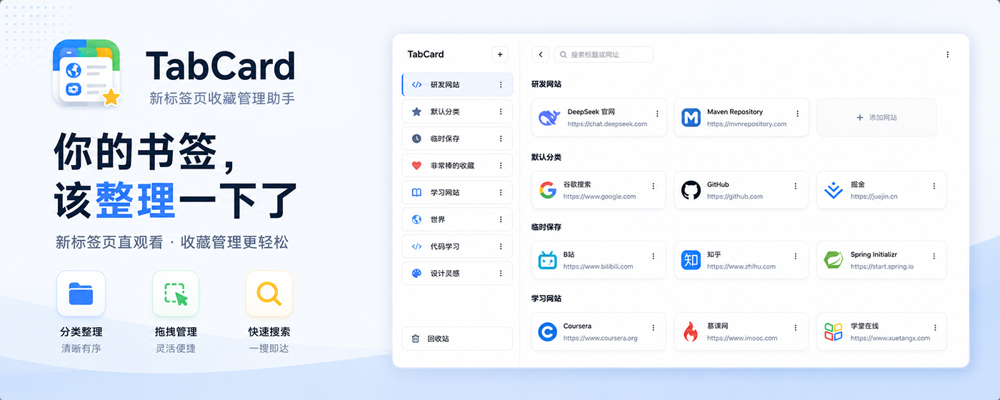
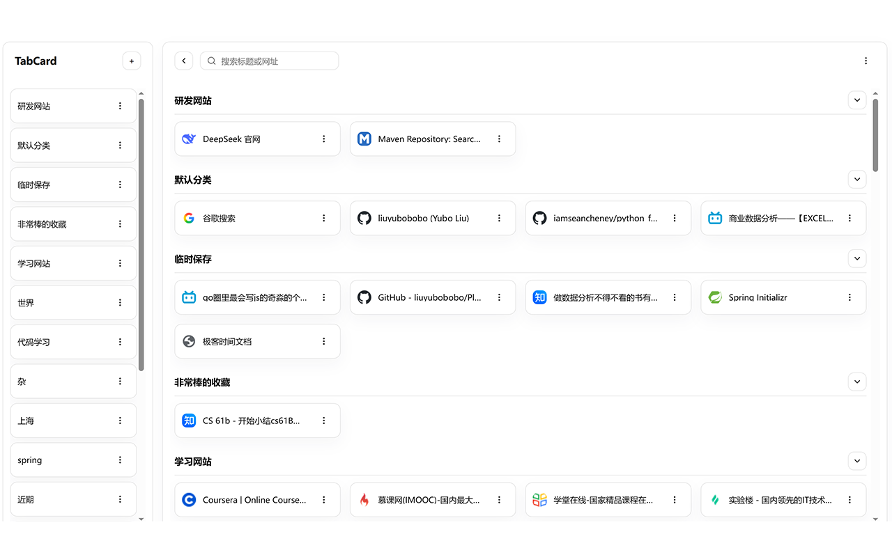
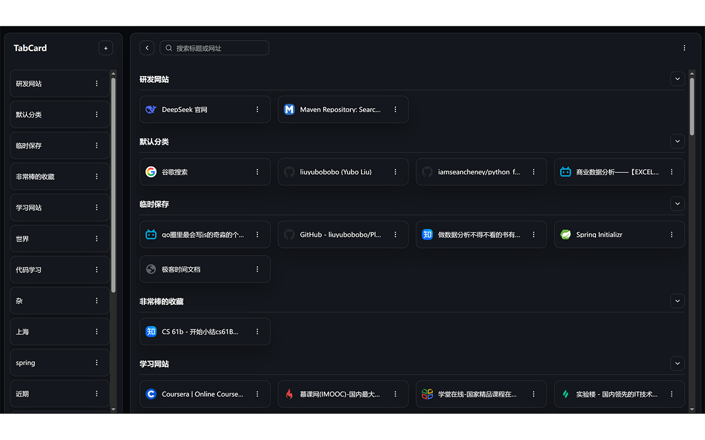
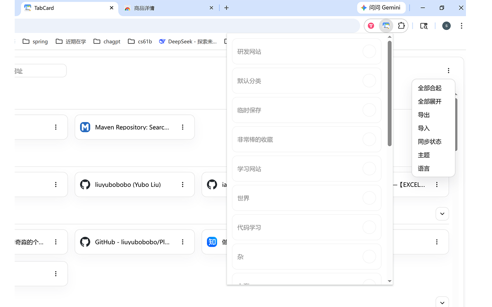

# TabCard

Chrome 新标签页收藏管理插件。



TabCard 不想替代书签栏，而是希望帮你更轻松地管理那些：

- 不常打开，但不想丢的网站
- 需要按主题分类整理的资源
- 想跨设备同步或手动备份的收藏

你可以把它理解成：

```text
收藏夹的管理助手
```

## 功能亮点

- 新标签页展示收藏内容，左侧分类，右侧网站卡片
- 支持分类拖拽、卡片拖拽、跨分类移动
- 支持直接将卡片拖到左侧分类中
- 支持搜索标题和网址
- 支持导入 Chrome 书签 HTML
- 支持导出为 HTML 文件
- 支持 Chrome 同步
- 支持浅色、深色、跟随浏览器
- 支持一键保存当前窗口全部标签页到“临时保存”

## 适合谁

TabCard 适合：

- 习惯收藏很多网站，但书签栏放不下的人
- 会长期积累工具站、灵感站、资源站的人
- 希望新标签页直接看到收藏内容的人
- 既想本地保存，也希望可以同步或导出备份的人

## 界面预览




## 安装方式

### 开发模式

```bash
npm install
npm run dev
```

然后打开：

```text
chrome://extensions
```

打开“开发者模式”，按 CRXJS 提示加载开发产物目录。

### 正式打包

```bash
npm install
npm run build
```

然后在 `chrome://extensions` 中选择“加载已解压的扩展程序”，加载项目下的 `dist` 目录。

建议正式使用时优先加载 `dist`。

## 基本使用

### 收藏当前网页

打开插件弹窗，点击某个分类，即可把当前网页保存到该分类。

如果当前网址已经存在：

- 点击当前分类：取消收藏
- 点击其他分类：移动到新分类

### 分类管理

- 新增分类
- 编辑分类名称
- 删除分类
- 拖拽调整顺序

### 卡片管理

- 点击卡片，在新标签页打开网站
- 编辑网站名称、网址、自定义 icon
- 删除卡片
- 分类内排序
- 跨分类移动
- 直接拖到左侧分类，自动放到目标分类最后

### 搜索

支持搜索：

- 网站标题
- 网站网址

搜索时左侧分类保持不变，右侧没有结果的分类会暂时隐藏。

## 导入与导出

### 导入

支持导入 Chrome 导出的书签 HTML 文件。

特点：

- 增量导入
- 不覆盖已有收藏

### 导出

支持导出当前收藏为 HTML 文件。

导出的文件可以：

- 重新导入 TabCard
- 导入 Chrome 浏览器书签

## 同步与备份

右上角菜单中可打开“同步状态”弹窗，查看：

- 本地最近更新时间
- 云端最近更新时间
- 云端状态
- 云端数据大小

如果 Chrome 同步可用，可在弹窗中手动点击“同步云端”。

如果 Chrome 同步不可用，仍然可以通过导出和导入进行备份与迁移。

## 一键保存全部标签页

插件弹窗中支持：

```text
一键保存全部标签页并关闭
```

执行后会：

1. 将当前窗口所有可收藏网页保存到 `临时保存`
2. 自动打开一个新的 TabCard 页面
3. 关闭刚才的网页标签

## 主题

支持三种主题模式：

- 浅色
- 深色
- 跟随浏览器

## Icon 说明

- 自动 icon 主要依赖浏览器能力获取
- 也支持手动填写自定义 icon
- 如果图标无法获取，会显示默认地球图标

这不会影响收藏功能本身。

## 当前说明

- 开发模式下，部分扩展能力可能不如正式打包稳定
- 图标、同步、新标签页覆盖等功能建议优先在 `npm run build` 后验证
- Chrome 同步依赖用户浏览器当前的同步状态

## 项目状态

目前 TabCard 已经完成主要功能闭环，适合日常个人使用，也适合继续做细节打磨或后续发布。
