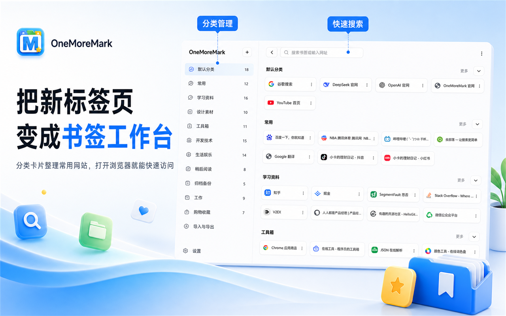
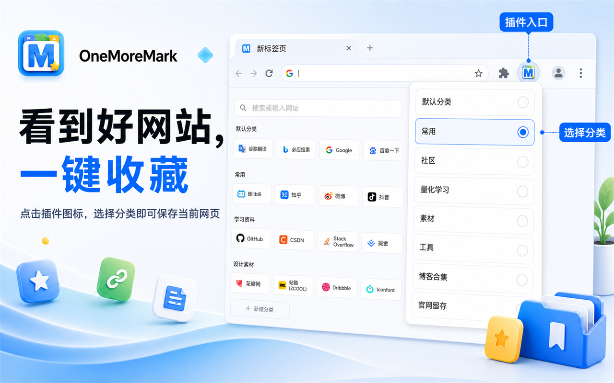
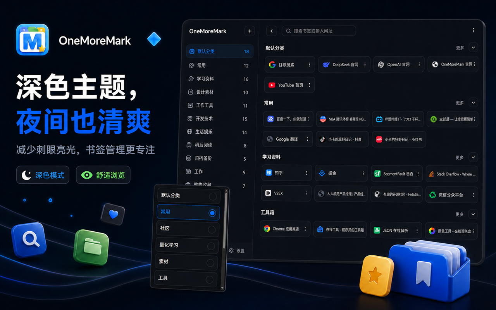

# OneMoreMark

[English](./README.md)

如果你的浏览器书签栏已经放不下常用网站，书签文件夹越分越深，临时打开的资料页又总是舍不得关，OneMoreMark 就是为这种日常场景准备的。

它不是让你“多收藏一点”，而是帮你把已经收藏、准备收藏、暂时还没来得及整理的网站，放进一个更清晰的新标签页工作台里。你每次打开新标签页，都能看到自己的资源地图，而不是重新在书签栏、历史记录和一排标签页里翻找。

## OneMoreMark 解决什么问题

很多网页不是每天都要打开，却又确实值得保留。比如 AI 工具、开发文档、设计灵感、产品案例、学习资料、调研链接、待读文章。

传统书签可以保存它们，但整理和复访并不轻松：

- 书签栏空间有限，高频网站和低频资料容易混在一起。
- 文件夹层级太深，保存之后很少再打开。
- 临时调研会开出一整排标签页，关掉怕丢，不关又影响工作。
- 收藏越来越多之后，很难快速判断“这个链接当初为什么留下”。

OneMoreMark 的思路很直接：把这些网站从拥挤的书签栏里拿出来，用分类和卡片重新组织，让收藏更容易看见、搜索、移动和备份。

## 把新标签页变成书签工作台

安装 OneMoreMark 后，Chrome 新标签页会变成一个可视化书签面板。左侧是分类，右侧是网站卡片，你可以按自己的工作方式整理资源。

它适合用来管理这些内容：

- 每天会用到的工具入口。
- 某个项目相关的资料集合。
- 设计、开发、产品、学习等主题资源。
- 临时调研后需要稍后处理的一组网页。

在新标签页里，你可以新建分类、重命名分类、拖拽调整顺序，也可以拖动卡片在分类之间移动。相比藏在菜单里的书签文件夹，卡片视图更适合浏览和复访。

## 浏览时一键保存网站

看到值得留下的网页时，点击浏览器工具栏里的 OneMoreMark 图标，就可以在弹窗里选择分类并保存当前页面。

这个动作适合处理那些“以后可能还会用到，但现在不想打断工作去整理”的网页。先保存到合适分类，之后再在新标签页里统一调整。

如果当前网址已经收藏过，OneMoreMark 会避免重复创建；如果你想换个分类，也可以把它移动到新的位置。

## 收起一整组临时标签页

调研、比价、查资料、找灵感时，浏览器经常会打开一整排临时标签页。它们不是都值得长期放在书签栏里，但直接关掉又可能丢失上下文。

OneMoreMark 支持一键保存当前窗口中的可收藏标签页，并归档到临时分类中。你可以先把工作现场收起来，让浏览器恢复清爽，等有时间再慢慢筛选和整理。

## 导入、导出与同步

如果你已经有一批 Chrome 书签，可以通过书签 HTML 文件导入 OneMoreMark；如果你想备份或迁移，也可以把 OneMoreMark 里的收藏导出为兼容 Chrome 的书签文件。

OneMoreMark 当前支持：

- 导入 Chrome 书签 HTML 文件。
- 导出当前收藏为 HTML 文件。
- 按分类保留收藏结构。
- 在 Chrome 同步可用时同步收藏数据。
- 查看本地与云端同步状态。

你的收藏数据保存在浏览器存储中。OneMoreMark 没有额外的账号系统，也不会把你的收藏强制绑定到某个云端服务；你可以用 Chrome 同步，也可以用导出文件做手动备份。

## 为日常使用准备的细节

OneMoreMark 不追求复杂，而是尽量让收藏管理这件事变得顺手。分类固定在左侧，内容集中在右侧，搜索入口保持可见，导入导出、同步状态和主题切换放在工具区，需要时再打开。

当前插件已支持：

- 新标签页收藏面板。
- 插件弹窗快速收藏当前网页。
- 分类管理与拖拽排序。
- 收藏卡片拖拽排序和跨分类移动。
- 标题与 URL 搜索。
- Chrome 书签 HTML 导入和导出。
- Chrome 同步状态查看与手动同步。
- 浅色、深色、跟随浏览器主题。
- 简体中文和英文界面。

## 安装方式

如果你只是想正常使用，推荐从 Chrome 网上应用店安装。这个方式最简单，后续更新也更方便。

**点击安装：Chrome 网上应用店 - OneMoreMark**

[https://chromewebstore.google.com/detail/tabcard/mimfanignegkbnkcenlnkpigpnpkmbgk](https://chromewebstore.google.com/detail/tabcard/mimfanignegkbnkcenlnkpigpnpkmbgk)

如果 Chrome 商店暂时无法访问，或者你希望手动安装，也可以从 GitHub Release 下载插件安装包。国内访问 GitHub 不方便时，可以使用 Gitee 仓库和 Gitee Release。

**点击查看：OneMoreMark GitHub 仓库**

[https://github.com/seven-share/OneMoreMark](https://github.com/seven-share/OneMoreMark)

**点击下载：GitHub Releases 安装包**

[https://github.com/seven-share/OneMoreMark/releases](https://github.com/seven-share/OneMoreMark/releases)

**点击查看：OneMoreMark Gitee 仓库**

[https://gitee.com/helloxiaotong/OneMoreMark](https://gitee.com/helloxiaotong/OneMoreMark)

**点击下载：Gitee Releases 安装包**

[https://gitee.com/helloxiaotong/OneMoreMark/releases](https://gitee.com/helloxiaotong/OneMoreMark/releases)

### **手动安装步骤**

1. 打开 GitHub Releases 或 Gitee Releases 页面，下载最新版本的压缩包。
2. 将压缩包解压到本地文件夹。
3. 在 Chrome 地址栏打开 `chrome://extensions/`。
4. 打开右上角“开发者模式”。
5. 点击“加载已解压的扩展程序”。
6. 选择刚刚解压后的插件目录。
7. 安装完成后，打开一个新标签页即可进入 OneMoreMark。

如果解压后有多个文件夹，通常选择包含 `manifest.json` 的那一层目录。Chrome 扩展必须从这个目录加载。
